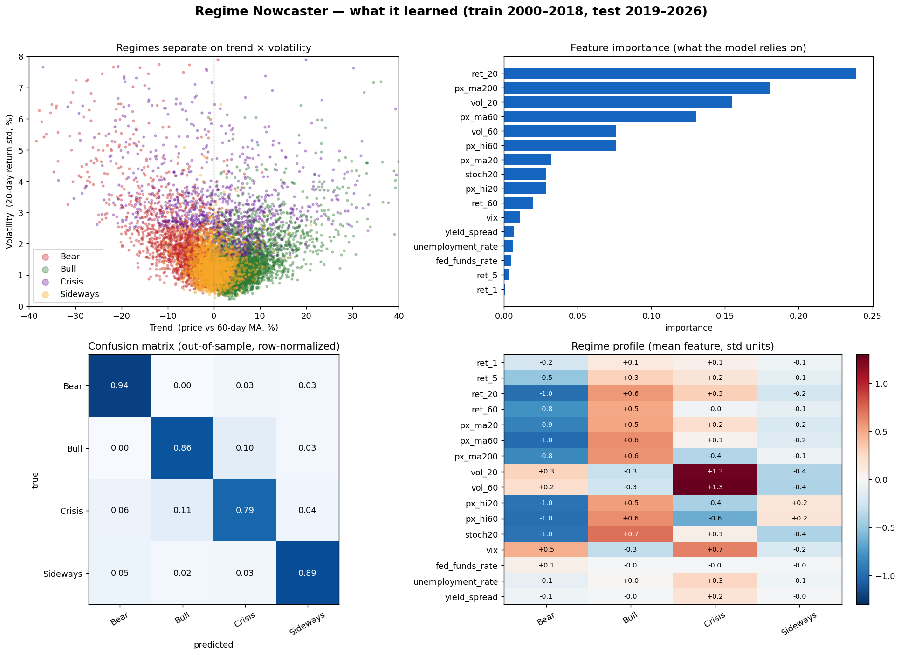

# Regime Classifier

A supervised **market-regime nowcaster**. Given trailing price and macro features as of day *t*, it classifies the **current** market state — Bull / Bear / Sideways / Crisis — across 39 US stocks and indices, 2000–2026.

> **Nowcasting, not forecasting.** Features end at day *t* and the label is day *t*'s regime. The model answers *"what regime are we in right now?"*, not *"what will happen next?"*. See [Scope & limitations](#scope--limitations).

> Research / educational project. Not investment advice.

---

## Approach

**Features (all trailing / past-only):**

- *Technical:* 1/5/20/60-day returns; price vs 20/60/200-day MA; 20/60-day volatility; price vs 20/60-day high; 20-day stochastic position.
- *Macro:* VIX, fed funds rate, unemployment rate, 10y–2y yield spread.

**Split:** chronological — train `< 2019-01-01` (~168k rows), test `>= 2019-01-01` (~69k rows; out-of-sample covers the COVID crash and the 2022 bear market). No shuffling; features are strictly trailing, so there is no look-ahead from the feature side.

**Model:** `RandomForestClassifier`, 300 trees, balanced class weights.

## Results (out-of-sample, 2019–2026)

| Regime | Precision | Recall | F1 |
|---|---|---|---|
| Bear | 0.919 | 0.935 | 0.927 |
| Bull | 0.959 | 0.862 | 0.908 |
| Sideways | 0.881 | 0.890 | 0.886 |
| Crisis | 0.570 | 0.790 | 0.663 |
| **Accuracy** | | | **0.877** |
| **Macro F1** | | | **0.846** |



## What the model discovered

Without being told any rules, the classifier recovers a textbook description of each regime (feature means, in standard-deviation units):

- **Bull** — positive trend, near highs, **low** volatility.
- **Bear** — strongly negative trend, near lows.
- **Crisis** — the defining feature is **volatility** (vol_20/vol_60 ≈ +1.3σ, VIX +0.7σ); trend is mixed, which is why Crisis and Bull are the main confusion pair (violent up-moves look similar).
- **Sideways** — everything near zero, volatility *below* average (calm and directionless).

Top features: `ret_20`, `px_ma200`, `vol_20`, `px_ma60` — i.e. the model settles on **medium-term trend + long-term trend + volatility**, matching how practitioners describe regimes. Macro features contribute little: these labels are essentially **price/volatility defined**, not macro defined.

---

## Data

The labeled dataset is **not included** (large, and externally sourced). Provide a daily CSV named `stock_market_regimes_2000_2026.csv` in the repo root with these columns:

```
date, ticker, close, returns, volatility, regime_label, regime_confidence,
macro_context, unemployment_rate, fed_funds_rate, cpi, 10y_treasury, 2y_treasury, vix
```

39 tickers (individual stocks + ^GSPC/^DJI/^IXIC/^RUT), daily, 2000-01-03 to 2026-01-30 (~245k rows).

## Usage

```bash
pip install -r requirements.txt

python regime_classifier.py  # train + evaluate the nowcaster
python regime_plot.py        # dashboard figure
```

## Files

| File | Purpose |
|---|---|
| `regime_classifier.py` | Feature engineering, time split, RandomForest nowcaster, evaluation |
| `regime_plot.py` | Dashboard: scatter, feature importance, confusion matrix, regime profile |

---

## Scope & limitations

- **Nowcasting, not forecasting.** It identifies the current regime; it does not predict future regimes or returns. Because features are trailing, the signal is inherently lagging — it cannot call a market top before the decline shows up in the data.
- **Raw labels are choppy.** The daily labels flip every ~7 trading days on average (median run length 3 days), so day-to-day predictions inherit some of that flicker. We experimented with smoothing the labels into persistent regimes, but rejected it: the smoothing decision ("merge a short run into its longer neighbor") requires knowing how long the *next* regime lasts — future information that would not be available in real time, and that systematically delayed regime flips around market tops. Any de-noising therefore belongs downstream of the classifier, not inside the labels.
- **Labels are price/volatility defined**, so high accuracy partly reflects the model re-discovering the labeling rule rather than independent predictive skill.
- **Overlapping samples.** Adjacent days share almost identical feature windows, so the effective sample size is far smaller than the row count.
- **Single test window** (2019–2026). Behavior in other periods is untested.
- Not connected to any trading strategy or backtest — this repo is only the classifier.

## Disclaimer

For research and educational purposes only. Not investment advice; results are not evidence of future performance.
