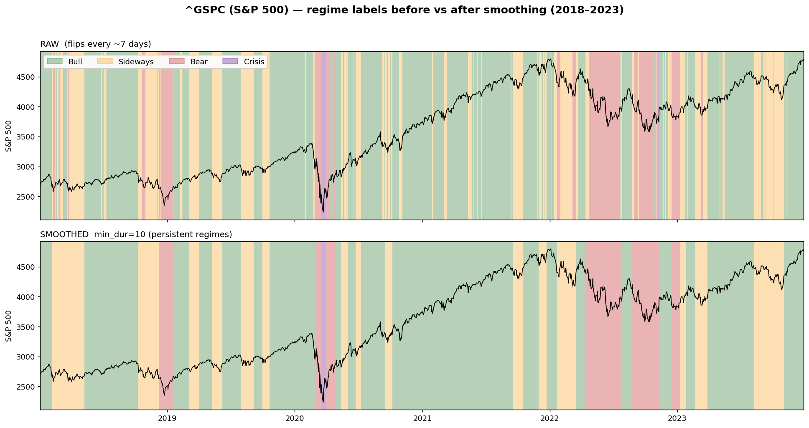

# Regime Classifier

A supervised **market-regime nowcaster**. Given trailing price and macro features as of day *t*, it classifies the **current** market state — Bull / Bear / Sideways / Crisis — across 39 US stocks and indices, 2000–2026.

> **Nowcasting, not forecasting.** Features end at day *t* and the label is day *t*'s regime. The model answers *"what regime are we in right now?"*, not *"what will happen next?"*. See [Scope & limitations](#scope--limitations).

> Research / educational project. Not investment advice.

---

## Why this exists

Raw daily regime labels are **noisy**: they flip every ~7 days (median run length 3 days, 70% of segments last ≤5 days). Real market regimes do not switch that fast — most of that churn is labeling noise. So the pipeline has two stages:

1. **Smooth** the labels into persistent regimes.
2. **Learn** a classifier that maps market features to those clean regimes, and inspect *what characterizes each regime*.

---

## Part 1 — Label smoothing

Short regime runs (below `min_dur` trading days) are merged into their longer neighbor until every segment is persistent. With `min_dur = 10`:

| | flip rate | median run | fragments ≤5d | class mix (Bull/Sideways/Bear/Crisis) |
|---|---|---|---|---|
| Raw | 14.9% | 3 days | 70% | 42.3 / 23.1 / 22.4 / 12.1 |
| Smoothed | **2.6%** | **27 days** | **0%** | 45.5 / 19.9 / 22.9 / **11.8** |

The class balance is essentially preserved — in particular **Crisis survives** (12.1% → 11.8%), confirming Crisis periods are genuinely clustered rather than scattered noise.



The smoothed bands line up with textbook market history: the Q4-2018 selloff (Bear), the COVID crash (Crisis, purple), the 2022 bear market, and the 2023 recovery.

> Smoothing uses information from both sides of a run to define the clean label, so the smoothed labels are a **ground truth for training/evaluation** — like any label they are not available in real time. The causal constraint is only on *features* (past-only), never on labels.

---

## Part 2 — The nowcast classifier

**Features (all trailing / past-only):**

- *Technical:* 1/5/20/60-day returns; price vs 20/60/200-day MA; 20/60-day volatility; price vs 20/60-day high; 20-day stochastic position.
- *Macro:* VIX, fed funds rate, unemployment rate, 10y–2y yield spread.

**Split:** chronological — train `< 2019-01-01`, test `>= 2019-01-01` (out-of-sample covers the COVID crash and the 2022 bear market). No shuffling; features are strictly trailing, so there is no look-ahead from the feature side.

**Model:** `RandomForestClassifier`, 300 trees, balanced class weights.

### Results (out-of-sample, 2019–2026)

| Regime | Precision | Recall | F1 |
|---|---|---|---|
| Bear | 0.834 | 0.821 | 0.827 |
| Bull | 0.928 | 0.775 | 0.845 |
| Sideways | 0.658 | 0.784 | 0.716 |
| Crisis | 0.505 | 0.761 | 0.607 |
| **Accuracy** | | | **0.787** |
| **Macro F1** | | | **0.749** |


### What the model discovered

Without being told any rules, the classifier recovers a textbook description of each regime (feature means, in standard-deviation units):

- **Bull** — positive trend, near highs, **low** volatility.
- **Bear** — strongly negative trend, near lows.
- **Crisis** — the defining feature is **volatility** (vol_20/vol_60 ≈ +1.3σ, VIX +0.7σ); trend is mixed, which is why Crisis and Bull are the main confusion pair (violent up-moves look similar).
- **Sideways** — everything near zero, volatility *below* average (calm and directionless).

Top features: `px_ma200`, `vol_20`, `px_ma60`, `vol_60`, `ret_20`. Macro features contribute little — these labels are essentially **price/volatility defined**, not macro defined.

### A note on the accuracy number

A variant trained on the **raw** (unsmoothed) labels scores ~0.88 accuracy — higher, but partly because choppy labels are locally easy to fit. The smoothed model scores lower (0.787) because it solves a harder, more useful problem: identifying the persistent regime *even when short-term price action is noisy* (e.g. a pullback inside an ongoing bull is still labeled Bull). Lower raw accuracy here reflects a more meaningful target, not a worse model.

---

## Data

The labeled dataset is **not included** (large, and externally sourced). Provide a daily CSV named `stock_market_regimes_2000_2026.csv` in the repo root with these columns:

```
date, ticker, close, returns, volatility, regime_label, regime_confidence,
macro_context, unemployment_rate, fed_funds_rate, cpi, 10y_treasury, 2y_treasury, vix
```

39 tickers (individual stocks + ^GSPC/^DJI/^IXIC/^RUT), daily, 2000-01-03 to 2026-01-30 (~245k rows).

---

## Usage

```bash
pip install -r requirements.txt

python regime_smooth.py      # Part 1: smoothing stats + writes smoothed dataset
python regime_smooth_viz.py  # Part 1: raw-vs-smoothed figure
python regime_classifier.py  # Part 2: train + evaluate the nowcaster
python regime_plot.py        # Part 2: dashboard figure
```

## Files

| File | Purpose |
|---|---|
| `regime_smooth.py` | Label smoothing (min-duration consolidation) + choppiness stats |
| `regime_classifier.py` | Feature engineering, time split, RandomForest nowcaster, evaluation |
| `regime_plot.py` | Dashboard: scatter, feature importance, confusion matrix, regime profile |
| `regime_smooth_viz.py` | Raw vs smoothed regime bands on the S&P 500 |

---

## Scope & limitations

- **Nowcasting, not forecasting.** It identifies the current regime; it does not predict future regimes or returns. Because features are trailing, the signal is inherently lagging.
- **Labels are price/volatility defined**, so high accuracy partly reflects the model re-discovering the labeling rule rather than independent predictive skill.
- **Single test window** (2019–2026). Behavior in other periods is untested.
- Not connected to any trading strategy or backtest here — this repo is only the regime classifier.

## Disclaimer

For research and educational purposes only. Not investment advice; results are not evidence of future performance.
